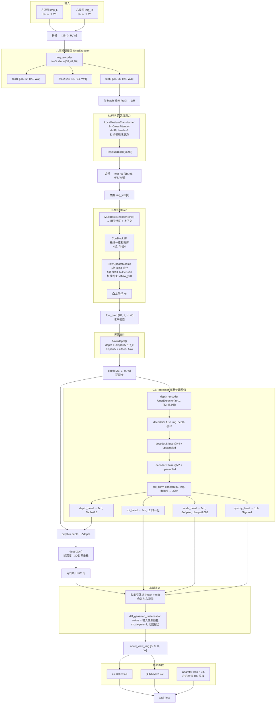

# GPS-Gaussian+ 基座项目完整说明书

> 基于 [YaourtB/GPS_plus](https://github.com/YaourtB/GPS_plus) (T-PAMI 2025)
> 本文档详细记录原始基座代码的完整架构、数据流和关键实现细节，作为后续所有修改的对比基线。

---

## 一、项目概览

**GPS-Gaussian+** 是一个**前馈式**（feed-forward）的通用 3D 高斯溅射（Gaussian Splatting）框架，用于从**稀疏视角**实时渲染以人为中心的场景。

**核心思路**：给定一对经过校正的立体图像（左/右视图），网络以端到端方式预测每个像素对应的 3D 高斯参数（位置、旋转、缩放、不透明度），然后通过可微高斯光栅化渲染到新视角。

**关键特点**：
- **无需逐场景优化**：不同于原始 3DGS 需要每个场景训练数小时，GPS-Gaussian+ 通过单次前向传播即可渲染
- **实时性能**：轻量化设计（3 次 RAFT 迭代 + 小通道网络）
- **像素级高斯**：每个像素预测一个高斯原语，scale 限制在 0.002 以内
- **颜色来自输入像素**：不预测颜色，直接使用输入图像的像素颜色

---

## 二、项目文件结构

```
GPS_plus/
├── train.py                       # 主训练脚本
├── test.py                        # 新视角合成测试脚本
├── run_interpolation.py           # 自由视角插值渲染脚本
│
├── config/
│   ├── stereo_human_config.py     # YACS 配置定义（所有可配参数的 schema）
│   └── stage.yaml                 # 默认训练配置文件
│
├── lib/                           # 核心库
│   ├── network.py                 # 主模型 RtStereoHumanModel
│   ├── human_loader.py            # 数据集 StereoHumanDataset
│   ├── GaussianRender.py          # 高斯点云→渲染的桥接 (pts2render)
│   ├── gs_parm_network.py         # 高斯参数回归网络 GSRegresser
│   ├── attention_module.py        # LoFTR 风格交叉注意力模块
│   ├── utils.py                   # flow2depth, depth2pc 等核心工具函数
│   ├── loss.py                    # RAFT flow loss (实际未使用)
│   ├── embedder.py                # NeRF 风格位置编码 (已导入但未使用)
│   ├── dep_utils.py               # 深度工具函数 (main 分支上的 utils.py)
│   ├── train_recoder.py           # TensorBoard 日志和文件备份
│   └── gs_utils/
│       ├── loss_utils.py          # L1 loss, SSIM loss
│       ├── image_utils.py         # PSNR, MSE
│       └── graphics_utils.py      # 投影矩阵, World2View 变换
│
├── core/                          # RAFT-Stereo 核心模块
│   ├── __init__.py
│   ├── raft_stereo_human.py       # RAFTStereoHuman 立体匹配模型
│   ├── extractor.py               # UnetExtractor, MultiBasicEncoder
│   ├── corr.py                    # CorrBlock1D (极线一维相关体)
│   ├── update.py                  # GRU 迭代更新模块
│   └── utils/
│       ├── utils.py               # InputPadder, bilinear_sampler, coords_grid
│       ├── augmentor.py           # 数据增强
│       └── frame_utils.py         # 光流/视差 I/O
│
├── gaussian_renderer/
│   └── __init__.py                # diff_gaussian_rasterization 的 render() 封装
│
├── data_process/                  # 数据预处理脚本
│   ├── step_0rect.py              # THumanMV 立体校正
│   ├── step_0rect_custom.py       # 自定义数据立体校正
│   ├── step_1.py                  # THumanMV 新视角数据组织
│   └── step_1_custom.py           # 自定义数据组织
│
├── enviroment.yml                 # Conda 环境配置
├── LICENSE                        # MIT 许可证
└── README.md                      # 原始项目说明
```

---

## 三、完整数据流管线

### 3.1 架构全景图 (Mermaid)



### 3.2 数据流详细说明

| 步骤 | 输入 | 输出 | 模块 |
|------|------|------|------|
| 1. 特征提取 | `[2B, 3, H, W]` 图像 | 3 级特征 @x2/x4/x8 | `UnetExtractor` |
| 2. 交叉注意力 | `feat3` 的 L/R 拆分 | 增强的 `feat_cs` | `LocalFeatureTransformer` |
| 3. 立体匹配 | `feat_cs` + `flow_init` | `flow_pred [2B,1,H,W]` | `RAFTStereoHuman` |
| 4. 流→深度 | flow, Tf_x, offset | 逆深度图 | `flow2depth()` |
| 5. 参数回归 | 深度 + 图像特征 | rot(4), scale(3), opa(1), Δdepth(1) | `GSRegresser` |
| 6. 深度细化 | 初始深度 + Δdepth | 细化后的逆深度 | 加法 |
| 7. 反投影 | 逆深度 + 相机参数 | 3D 世界坐标 | `depth2pc()` |
| 8. 渲染 | xyz + rot + scale + opacity + pixel color | 新视角图像 | `pts2render()` → `render()` |

---

## 四、核心模块详解

### 4.1 `RtStereoHumanModel` (lib/network.py)

主模型，组合所有子模块：

```python
class RtStereoHumanModel(nn.Module):
    def __init__(self, cfg, with_gs_render=False):
        self.img_encoder = UnetExtractor(in_channel=3, encoder_dim=cfg.raft.encoder_dims)
        self.loftr_coarse = LocalFeatureTransformer()
        self.raft_stereo = RAFTStereoHuman(cfg.raft)
        if with_gs_render:
            self.gs_parm_regresser = GSRegresser(cfg, rgb_dim=3, depth_dim=1)
```

**forward 流程**：
1. 左右图像拼接 → 共享 `img_encoder` 提取 3 级特征
2. 最粗层特征 (x8) 经 `loftr_coarse` 交叉注意力增强
3. `raft_stereo` 进行 3 次迭代立体匹配，输出水平视差 (flow)
4. `flow2gsparms()` 方法：
   - `flow2depth()` 将视差转为逆深度
   - `GSRegresser` 回归高斯参数 + 深度残差
   - 逆深度加上残差后 `depth2pc()` 反投影到 3D

**关键设计**：flow_init 由常数逆深度 (0.3) 计算得到，给 RAFT 一个温启动。

### 4.2 `UnetExtractor` (core/extractor.py)

共享的 3 级 U-Net 编码器，用于图像特征和深度特征提取：

| 级别 | 输入通道 | 输出通道 | 空间缩放 |
|------|---------|---------|---------|
| in_ds | 3 (或 1) | 32 | x2 (stride-2 conv) |
| res1 | 32 | encoder_dim[0]=32 | x2 |
| res2 | 32 | encoder_dim[1]=48 | x4 |
| res3 | 48 | encoder_dim[2]=96 | x8 |

返回 `(feat1, feat2, feat3)`，分别在 x2, x4, x8 分辨率。

### 4.3 `LocalFeatureTransformer` (lib/attention_module.py)

LoFTR 风格的交叉注意力模块，是基座项目的**唯一注意力机制**：

- **结构**：2 层 `Crossatt_EncoderLayer` + 1 个 `ResidualBlock(96, 96)`
- **参数**：`d_model=96`, `nhead=8`
- **注意力方式**：**行级极线注意力**
  - `[B, C, H, W]` → reshape 为 `[B×H, W, C]`
  - 在每一行（极线方向）上做 cross-attention
  - 利用立体校正后左右视图行对齐的特性，极大减少计算量

```python
# 交互方式: 两层交替交叉注意力
for layer in layers:
    feat0 = layer(feat0, feat1)  # L attend to R
    feat1 = layer(feat1, feat0)  # R attend to L
feat0, feat1 = self.resid(feat0), self.resid(feat1)
```

### 4.4 `RAFTStereoHuman` (core/raft_stereo_human.py)

基于 RAFT-Stereo 的立体匹配模块：

- **cnet** (`MultiBasicEncoder`)：从共享特征 `feat_cs` 提取相关特征和上下文
- **CorrBlock1D**：一维极线相关体（4 级金字塔，半径 4）
- **FlowUpdateModule**：
  - 仅 **3 次 GRU 迭代**（原始 RAFT 用 12+）
  - 单层 GRU (`n_gru_layers=1`)，hidden_dim=96
  - **极线约束**：`delta_flow[:, 1] = 0.0`（强制垂直方向无位移）
  - **凸上采样** (convex upsampling)：x8 分辨率→全分辨率
  - 仅输出水平分量 `flow[:, :1]`

### 4.5 `GSRegresser` (lib/gs_parm_network.py)

高斯参数回归网络——从深度和图像特征预测高斯属性：

**架构**：双编码器 + 多尺度解码器

```
img_feat3(96) + depth_feat3(96) → decoder3(96)
img_feat2(48) + depth_feat2(48) + ↑decoder3(96) → decoder2(64)
img_feat1(32) + depth_feat1(32) + ↑decoder2(64) → decoder1(48)
↑decoder1(48) + img(3) + depth(1) → out_conv(32)
```

**四个预测头**（从共享的 32 通道特征预测）：

| 预测头 | 输出通道 | 激活函数 | 取值范围 | 含义 |
|--------|---------|---------|---------|------|
| rot_head | 4 | L2 归一化 | 单位四元数 | 高斯旋转 |
| scale_head | 3 | Softplus + clamp(≤0.002) | [0, 0.002] | 高斯缩放 |
| opacity_head | 1 | Sigmoid | [0, 1] | 不透明度 |
| depth_head | 1 | Tanh × 0.5 | [-0.5, 0.5] | 深度残差 |

**关键设计**：
- scale 限制极小 (≤0.002)，保持高斯为**像素级小点**
- 深度残差范围 ±0.5（逆深度空间），不会过度修改初始深度

### 4.6 `pts2render` (lib/GaussianRender.py)

高斯点云→渲染的桥接函数：

1. 遍历 batch 中每个样本
2. 从 `lmain` 和 `rmain` 中收集 **有效点**（mask > 0.5）
3. 合并两个视图的点云（xyz, rgb, rot, scale, opacity）
4. **RGB 直接来自输入像素**：`pts_rgb = img.permute(1,2,0).view(-1,3) * 0.5 + 0.5`
5. 调用 `gaussian_renderer.render()` 进行 CUDA 光栅化

### 4.7 `render()` (gaussian_renderer/__init__.py)

封装 `diff_gaussian_rasterization`：

```python
raster_settings = GaussianRasterizationSettings(
    image_height, image_width,
    tanfovx, tanfovy,
    bg=bg_color,
    viewmatrix=world_view_transform,
    projmatrix=full_proj_transform,
    sh_degree=3,
    campos=camera_center,
    antialiasing=False
)
rendered_image = rasterizer(
    means3D=pts_xyz,
    colors_precomp=pts_rgb,  # 预计算颜色，不使用 SH
    opacities=opacity,
    scales=scales,
    rotations=rotations
)
```

### 4.8 `flow2depth` / `depth2pc` (lib/utils.py)

**flow2depth — 视差→逆深度**：
```python
offset = ref_intr[0,2] - intr[0,2]       # 主点偏移
disparity = offset - flow_pred            # 视差
depth = -disparity / Tf_x                 # 逆深度 (Tf_x = 焦距 × 基线)
```

**depth2pc — 逆深度→3D 世界坐标**：
```python
# 1. 创建像素坐标网格 (x, y)
# 2. z = 1 / (depth + ε)         → 真实深度
# 3. 减去主点 → 去中心化
# 4. 乘以 z → 相机坐标系 3D 点
# 5. 除以焦距 → 归一化
# 6. R^T @ points - R^T @ t → 世界坐标
```

---

## 五、配置系统

### 5.1 配置定义 (config/stereo_human_config.py)

使用 YACS 的 `CfgNode`，分为以下组：

| 配置组 | 关键参数 | 默认值 | 说明 |
|--------|---------|--------|------|
| **root** | `lr`, `wdecay`, `batch_size`, `num_steps` | 0.0002, 1e-5, 1, 100000 | 训练超参数 |
| | `stage1_ckpt`, `restore_ckpt` | None | 预训练权重路径 |
| **dataset** | `source_id` | [0, 1] | 左右视图相机编号 |
| | `train_novel_id` | [2, 3, 4, 5] | 训练时的新视角监督相机 |
| | `val_novel_id` | [2, 3] | 验证时的新视角相机 |
| | `inverse_depth_init` | 0.3 | RAFT 温启动的逆深度初始值 |
| | `bg_color` | [0, 0, 0] | 渲染背景色 |
| | `znear` / `zfar` | 0.01 / 100.0 | 投影矩阵近远平面 |
| **raft** | `train_iters` / `val_iters` | 3 / 3 | RAFT GRU 迭代次数 |
| | `encoder_dims` | [32, 48, 96] | 共享编码器通道数 |
| | `hidden_dims` | [96, 96, 96] | GRU 隐藏状态通道数 |
| | `n_gru_layers` | 1 | GRU 层数（1=最快） |
| | `corr_levels` / `corr_radius` | 4 / 4 | 相关体金字塔级数和半径 |
| **gsnet** | `encoder_dims` | [32, 48, 96] | 深度编码器通道数 |
| | `decoder_dims` | [48, 64, 96] | 解码器通道数 |
| | `parm_head_dim` | 32 | 预测头共享特征通道 |
| **record** | `loss_freq` / `eval_freq` | 3000 / 3000 | 日志和评估频率 |
| | `save_iter` | [20000, 30000, 40000] | 保存 checkpoint 的迭代 |

### 5.2 默认 stage.yaml

```yaml
name: 'gps_plus'
lr: 0.0002
wdecay: 1e-5
batch_size: 1
num_steps: 100000

dataset:
  source_id: [0, 1]
  train_novel_id: [2, 3, 4, 5]
  val_novel_id: [2, 3]
  use_hr_img: False
  use_depth_init: True
  use_local_data: True
  inverse_depth_init: 0.3

raft:
  mixed_precision: False
  train_iters: 3
  val_iters: 3
  encoder_dims: [32, 48, 96]
  hidden_dims: [96, 96, 96]

gsnet:
  encoder_dims: [32, 48, 96]
  decoder_dims: [48, 64, 96]
  parm_head_dim: 32

record:
  loss_freq: 3000
  eval_freq: 3000
```

---

## 六、数据加载 (lib/human_loader.py)

### 6.1 数据集结构

```
processed_data/
├── train/
│   ├── img/
│   │   └── {sample_name}/
│   │       ├── 0.jpg          # 左视图（校正后）
│   │       ├── 1.jpg          # 右视图（校正后）
│   │       ├── 2.jpg ~ 5.jpg  # 新视角监督/评估
│   ├── mask/
│   │   └── {sample_name}/
│   │       ├── 0.png, 1.png   # 前景 mask
│   ├── parameter/
│   │   └── {sample_name}/
│   │       ├── 0_1.json       # 立体对相机参数
│   │       ├── 2_extrinsic.npy, 2_intrinsic.npy  # 各视角参数
└── val/ ...
```

### 6.2 相机参数 JSON 结构 (`0_1.json`)

```json
{
  "intr0": [[fx, 0, cx], [0, fy, cy], [0, 0, 1]],    // 左视图内参 3×3
  "intr1": [[fx, 0, cx], [0, fy, cy], [0, 0, 1]],    // 右视图内参 3×3
  "extr0": [[r00,...,t0], [r10,...,t1], [r20,...,t2]], // 左视图外参 3×4
  "extr1": [[r00,...,t0], [r10,...,t1], [r20,...,t2]], // 右视图外参 3×4
  "Tf_x": [value]                                      // 焦距×基线 (标量)
}
```

### 6.3 数据字典结构

`StereoHumanDataset.__getitem__()` 返回的数据字典：

```python
{
  'name': 'sample_name',
  'lmain': {
    'img':       [3, H, W],    # 归一化到 [-1, 1]
    'mask':      [3, H, W],    # 二值 mask (0 或 1)
    'intr':      [3, 3],       # 内参矩阵
    'ref_intr':  [3, 3],       # 对侧视图内参（用于计算 offset）
    'extr':      [3, 4],       # 外参矩阵
    'Tf_x':      [1],          # 焦距×基线（正值）
    'flow_init': [1, H, W],   # 从常数逆深度 0.3 计算的初始 flow
  },
  'rmain': {
    # 同上，但 Tf_x 取反
    'Tf_x':      [-value],     # 注意: 右视图的 Tf_x 是负的
  },
  'novel_view': {
    'view_id':              [1],         # 随机选择的新视角 ID
    'img':                  [3, H, W],   # GT 图像，归一化到 [0, 1]
    'extr':                 [3, 4],      # 新视角外参
    'FovX':                 scalar,
    'FovY':                 scalar,
    'width':                int,
    'height':               int,
    'world_view_transform': [4, 4],      # 3DGS 格式的视图变换
    'full_proj_transform':  [4, 4],      # 3DGS 格式的完整投影
    'camera_center':        [3],         # 相机中心世界坐标
  }
}
```

### 6.4 重要细节

- **图像归一化**：源视图 `[-1, 1]`，新视角 GT `[0, 1]`
- **Tf_x 符号**：左视图为正，右视图取反（用于 `flow2depth` 公式）
- **数据重复**：`train_boost=50`, `val_boost=200`（重复数据集以模拟更多迭代）
- **新视角相机**：训练时从 `[2,3,4,5]` 随机选择，验证时从 `[2,3]` 选择
- **外参是 3×4**：不含底部 `[0,0,0,1]` 行

---

## 七、训练流程 (train.py)

### 7.1 训练循环

```python
for itr in range(100000):
    # 1. 获取数据
    data = fetch_data('train')

    # 2. 前向传播 (RAFT + 高斯参数预测)
    data, _, metrics = model(data, is_train=True)

    # 3. 高斯渲染
    data = pts2render(data, bg_color=[0,0,0])

    # 4. 计算损失
    Ll1 = l1_loss(render_novel, gt_novel)
    Lssim = 1.0 - ssim(render_novel, gt_novel)
    chamfer_loss = chamfer_distance(l_xyz_sampled, r_xyz_sampled)  # 各采样 10000 点
    loss = 0.8 * Ll1 + 0.2 * Lssim + 0.5 * chamfer_loss

    # 5. 反向传播
    scaler.scale(loss).backward()
    clip_grad_norm_(model.parameters(), 1.0)
    scaler.step(optimizer)
    scheduler.step()
```

### 7.2 损失函数

| 损失 | 权重 | 说明 |
|------|------|------|
| L1 | 0.8 | 渲染图像与 GT 的像素级 L1 |
| 1 - SSIM | 0.2 | 结构相似度损失 |
| Chamfer Distance | 0.5 | 左右点云一致性（各采样 10k 点，需要 pytorch3d） |

### 7.3 优化器配置

- **优化器**：AdamW, lr=0.0002, weight_decay=1e-5
- **调度器**：OneCycleLR, pct_start=0.01, anneal_strategy='linear'
- **梯度裁剪**：max_norm=1.0
- **混合精度**：GradScaler (由 `raft.mixed_precision` 控制)
- **BN 冻结**：RAFT-Stereo 中的 BatchNorm 保持 eval 模式

### 7.4 验证和保存

- 每 3000 步验证一次，计算 PSNR
- 如果 PSNR < 10，认为训练崩溃，自动退出
- 在 [20000, 30000, 40000] 步保存 checkpoint
- 每步保存最新 checkpoint (`*_latest.pth`)
- 验证时随机保存一张渲染结果到 `show/` 目录

### 7.5 Checkpoint 结构

```python
{
    'total_steps': int,
    'network': model.state_dict(),
    'optimizer': optimizer.state_dict(),
    'scheduler': scheduler.state_dict()
}
```

---

## 八、关键技术细节

### 8.1 逆深度表示

整个管线在**逆深度空间**工作：
- `inverse_depth_init = 0.3` 对应真实深度约 3.33m（场景最大深度）
- `flow2depth()` 输出的 depth 实际是逆深度
- `depth2pc()` 中 `z = 1/(depth + ε)` 转换为真实深度

### 8.2 立体校正

输入数据已经过 `step_0rect.py` 校正：
- 左右视图的极线对齐到同一水平行
- 这是 RAFT 行级交叉注意力和一维相关体的前提条件
- 校正后 `Tf_x` 编码了焦距和基线的乘积

### 8.3 flow_init 温启动

```python
# 从常数逆深度计算初始 flow
depth_init = 0.3 * ones(H, W)
flow_init = offset - (-depth_init * Tf_x)
```
这给 RAFT 一个合理的起始点，使得仅需 3 次迭代就能收敛。

### 8.4 两阶段训练

配置支持 `stage1_ckpt`：先训练 RAFT 立体匹配部分（无高斯渲染），再加载权重进行端到端训练。但在实际使用中，可以直接端到端训练。

### 8.5 颜色来源

**不预测颜色**——高斯的颜色直接来自输入图像的像素值：
```python
rgb_i = data[view]['img'][i].permute(1,2,0).view(-1, 3)  # 从输入图像取
pts_rgb_i = rgb_i * 0.5 + 0.5  # [-1,1] → [0,1]
```
这是一个重要的设计选择：网络只需要学习**几何和高斯形状**，颜色信息完全来自观测。

---

## 九、模块参数量概览

| 模块 | 参数量级 | 说明 |
|------|---------|------|
| `img_encoder` (UnetExtractor) | ~0.3M | 轻量 3 级 U-Net |
| `loftr_coarse` (LocalFeatureTransformer) | ~0.5M | 2 层交叉注意力 |
| `raft_stereo.cnet` (MultiBasicEncoder) | ~0.8M | 上下文网络 |
| `raft_stereo.update_module` | ~0.5M | GRU 更新 |
| `gs_parm_regresser` (GSRegresser) | ~1.0M | 双编码+4 头 |
| **总计** | **~3M** | 非常轻量 |

---

## 十、与修改版本的对比要点

后续任何修改都可以从以下维度与基座对比：

### 10.1 深度估计方式
- **基座**：RAFT-Stereo 立体匹配 → flow → 逆深度
- **需关注**：替换为其他深度估计方法时，是否保持逆深度表示？是否仍需要 Tf_x？

### 10.2 特征提取
- **基座**：轻量 UnetExtractor [32, 48, 96] + 行级 LoFTR 交叉注意力
- **需关注**：替换骨干网络后，特征维度变化对下游模块的影响

### 10.3 高斯参数预测
- **基座**：GSRegresser (图像+深度双编码, 4 个 CNN 头, 32 通道共享特征)
- **需关注**：新方法是否保留 scale clamp(0.002)？颜色是否仍来自像素？

### 10.4 渲染方式
- **基座**：合并左右有效点 → diff_gaussian_rasterization
- **需关注**：目标视角投影方式？是否改为单视图渲染？

### 10.5 损失函数
- **基座**：0.8×L1 + 0.2×(1-SSIM) + 0.5×Chamfer
- **需关注**：是否引入新损失？Chamfer 是否仍然需要？

### 10.6 数据格式
- **基座**：源图像 [-1,1]，GT [0,1]，外参 3×4，逆深度表示
- **需关注**：新方法是否需要 4×4 外参？深度表示是否改变？

---

## 附录 A：关键公式

### A.1 flow → depth
```
offset = ref_intr[0,2] - intr[0,2]
disparity = offset - flow_pred
depth_inv = -disparity / Tf_x
```

### A.2 depth → point cloud (逆深度版本)
```
z = 1 / (depth_inv + ε)
x_cam = (u - cx) * z / fx
y_cam = (v - cy) * z / fy
P_world = R^T @ [x_cam, y_cam, z]^T - R^T @ t
```

### A.3 高斯参数范围
```
rotation:    L2 归一化的四元数 [q0, q1, q2, q3]
scale:       Softplus → clamp(max=0.002)  ≈  [0, 0.002]
opacity:     Sigmoid                       ∈  [0, 1]
Δdepth:      Tanh × 0.5                   ∈  [-0.5, 0.5]
```

### A.4 损失
```
L_total = 0.8 × L1(render, GT) + 0.2 × (1 - SSIM(render, GT)) + 0.5 × Chamfer(L_pts, R_pts)
```

---

## 附录 B：依赖关系

```
torch, torchvision
numpy, opencv-python, scipy, trimesh
einops, kornia
yacs (配置管理)
pytorch3d (Chamfer Distance, 可选)
diff-gaussian-rasterization (3DGS CUDA 光栅化)
```

---

*本文档基于 GPS-Gaussian+ main 分支 (commit history 截至创建时) 编写，作为所有后续分支修改的对比基准。*
